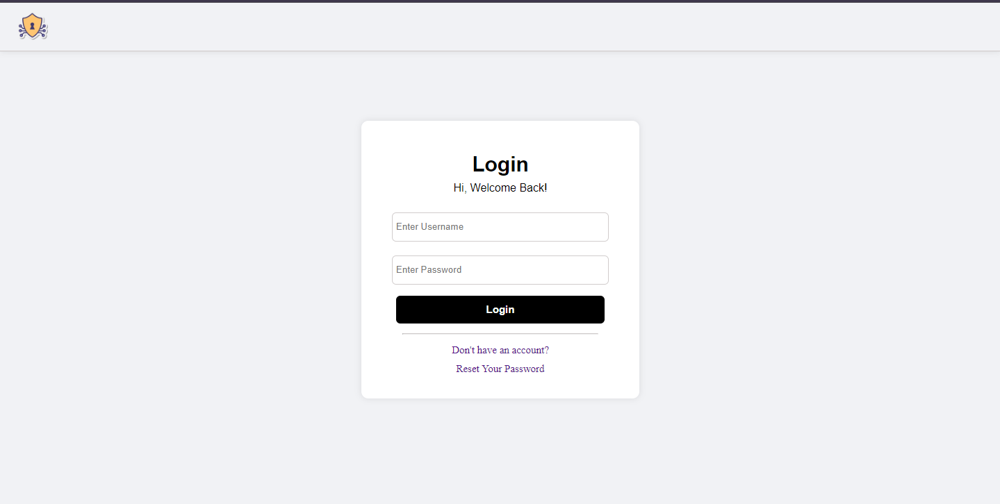

# Web Security Testing - Scan your website against malware.

Web security testing a python based web application that lets users scan their website to find vulnerabilities. It scan and then suggest recommended steps to overcome these issues.

It scan website for these features:
* SQL Injection
* Cross Site Scripting
* Api Endpoints
* Securtiy Headers
* Open Redirects
* TLS Checker

## Screenshots Of My Project

Here are some screenshots of the project:

### Homepage

### Register Page

### Login Page

### Scanning Page

